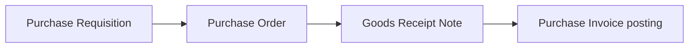

# Procurement forms — user guide (English)

**Audience:** End users, trainers, QA, and developers who need a concise map of the **Purchase Requisition (PR)**, **Purchase Order (PO)**, **Goods Receipt Note (GRN)**, and **GRN-linked Purchase Invoice** screens.

**Last aligned to codebase:** 2026-04-09 (`routes/web.php`, `resources/js/Pages/Inventory/*`).

---

## 1. Prerequisites

| Requirement | Why it matters |
|-------------|----------------|
| Signed in | All routes use authentication (`web.auth`). |
| Company and location | Lists and saves are scoped to your company/location. If either is missing, you may see an error or empty data. |
| Master data | **Items**, **UOM**, **vendors**, **locations/warehouses**, **currencies**, **tax categories** (for PO lines), and **departments** (optional on PR) should exist before smooth data entry. |
| Item Master GL | For **Purchase Invoice posting**, each received line’s item must have an **inventory GL account** mapped. The Purchase Invoice screen warns you if anything is missing. |

The UI labels come from translations (`lang/en/inventory.json`, etc.); this guide describes behaviour in English.

---

## 2. Typical flow (source to ledger)

- **PR:** Internal request (what is needed, when, rough cost).
- **PO:** Commitment to the vendor (quantities, price, terms). Can pull lines from an **approved** PR.
- **GRN:** Physical receipt against a PO (quantities, QC, costing).
- **Purchase Invoice:** Accounting voucher posted from a GRN in **QC pending** status: debits inventory (and tax where applicable), credits vendor payables.

---

## 3. Purchase Requisition (PR)

**Purpose:** Record what to buy before a PO exists.

### URLs

| Action | Path |
|--------|------|
| List | `/inventory/purchase-requisition` |
| Create | `/inventory/purchase-requisition/create` |
| Edit | `/inventory/purchase-requisition/{id}/edit` |

### Header fields

| Field | Required | Notes |
|-------|----------|--------|
| PR number | — | Read-only preview on create; final number assigned on save (per document numbering rules). |
| PR date | Yes | Document date. |
| Required by date | No | Header-level need date. |
| Deliver to location | No | Where goods should go. |
| Delivery address | No | Free text. |
| Currency | No | For estimates / reporting context. |
| FX rate | No | Decimal; used when foreign currency is relevant. |
| Priority | Yes | Normal / High / Urgent. |
| Initial status | Yes | **Draft** or **Approved**. Choosing Approved on save records the PR as approved in one step (subject to server rules). |
| Department | No | Optional organisation dimension. |
| Requested by | No | Text (e.g. requester name). |
| Justification | No | Why the purchase is needed. |
| Notes | No | Internal comments. |

### Line grid (one or more rows)

| Field | Required | Notes |
|-------|----------|--------|
| Item | Yes | Search/select from Item Master; picking an item can prefill description and default UOM. |
| Description | No | Editable; max length per UI. |
| UOM | Yes | Must match how you count the quantity. |
| Quantity | Yes | Must be greater than zero. |
| Estimated unit price | No | Optional; drives an on-screen **estimated subtotal** (quantity × price per line). |
| Need by date | No | Line-level date. |
| Line notes | No | Per-line comments. |

**Actions:** **Add line** / remove line (at least one line must remain). **Save** submits header + lines; **Reset** reloads defaults or original data in edit mode.

**After save:** Use the list screen for approval workflows, printing, and linking to PO where the product supports it.

---

## 4. Purchase Order (PO)

**Purpose:** Confirm purchase terms with a vendor and ordered quantities.

### URLs

| Action | Path |
|--------|------|
| List | `/inventory/purchase-order` |
| Create | `/inventory/purchase-order/create` |
| Edit | `/inventory/purchase-order/{id}/edit` |

### Linking to a PR (optional)

At the top of the create/edit form:

1. Choose **With PR** or **Without PR**.
2. If **With PR**, select an **approved** PR and click **Load from PR**.
3. The system fills lines from PR lines that still have **open quantity** for PO conversion. Header fields such as ship-to, address, currency, and FX rate may be prefilled from the PR.

If no open lines remain, you will see an error indicating the PR is fully consumed for PO purposes.

### Header fields

| Field | Required | Notes |
|-------|----------|--------|
| PO number | — | Read-only preview on create. |
| Vendor | Yes | Vendor master account. |
| PO type | Yes | Standard / Blanket / Import (labels from i18n). |
| Blanket PO | No | Toggle; aligns with blanket agreements. |
| Vendor reference | No | Supplier’s quote or reference. |
| PO date | Yes | |
| Expected delivery date | No | Header-level ETA. |
| Ship to location | No | |
| Delivery address | No | |
| Currency / FX rate | No | Same pattern as PR. |
| Incoterms | No | e.g. EXW, FOB, CIF (dropdown list). |
| Incoterms location | No | Place text for the incoterm. |
| Payment terms | No | e.g. Net 30, COD, Advance. |
| Advance payment % | No | 0–100 when relevant. |
| Tax inclusive | No | Toggle for price interpretation. |
| Header discount % | No | 0–100. |
| Initial status | Yes | Draft or Approved on save. |
| Notes | No | |

### Line grid

| Field | Required | Notes |
|-------|----------|--------|
| Item | Yes | Search/select; prefills description, UOM, default tax category when available. |
| Description | No | |
| UOM | Yes | |
| Ordered quantity | Yes | Must be &gt; 0. |
| Unit price | Yes | Must be &gt; 0 (validated on save). |
| Line discount % | No | Reduces effective unit price in the on-screen subtotal. |
| Tax category | No | Used for tax-aware downstream logic where configured. |
| Expected line delivery date | No | |
| Receive location | No | Where this line may be received. |
| Line notes | No | |

**Validation:** Every line must have item, UOM, positive quantity, and positive unit price.

---

## 5. Goods Receipt Note (GRN)

**Purpose:** Record what arrived against a **Purchase Order**, including QC and put-away hints.

### URLs

| Action | Path |
|--------|------|
| List | `/inventory/goods-receipt-note` |
| Create | `/inventory/goods-receipt-note/create` |
| Edit | `/inventory/goods-receipt-note/{id}/edit` |
| Purchase Invoice (form) | `/inventory/goods-receipt-note/{id}/purchase-invoice` |
| Printable layouts | `/inventory/goods-receipt-note/{id}/invoice/summary` or `.../detailed` |

### Loading from a PO (create only)

1. Select an **approved** PO that still has **open receipt quantity**.
2. Click **Load from PO**. Vendor, default receive location, currency, FX rate, and lines are prefilled.
3. **PO** and **vendor** are fixed after load; changing PO clears lines.

**Edit mode:** The PO link is read-only; use the list workflow for submitting QC and posting.

### Header fields

| Field | Required | Notes |
|-------|----------|--------|
| GRN number / Vendor display | — | Read-only; vendor fills after PO load. |
| GRN type | Yes | e.g. Standard, Import, Return from vendor, Sample, Consolidated. |
| Receipt date | Yes | Physical receipt date. |
| Posting date | No | Optional accounting date hint. |
| Receive location | No | Default receipt warehouse/location. |
| Vehicle / transporter / driver contact / seal / container | No | Logistics traceability. |
| BOL/AWB, packing list ref, vendor delivery note | No | Document references. |
| Currency / FX rate | No | Usually from PO. |
| Overall QC status | Yes | Pending / Passed / Failed / Partial. |
| Landed cost | No | Toggle + reference text for future landed-cost linkage. |
| Three-way match | — | Read-only display of match status when implemented. |
| Initial status | Yes | **Draft** or **QC pending** on first save (per form). |
| Notes | No | |

### Line grid (from PO)

Read-only reference columns: **PO ordered qty**, **Previously received**, item label, UOM.

Editable / entry columns:

| Field | Rules |
|-------|--------|
| Receipt qty | ≥ 0; at least one line must have receipt qty &gt; 0. Cannot exceed **pending PO quantity** (ordered − previously received). |
| Unit cost | Required on lines with receipt qty &gt; 0; ≥ 0. |
| Accepted qty | Optional; if blank, treated as full acceptance up to receipt qty. Cannot exceed receipt qty. |
| Rejection reason | Required when accepted qty is below receipt qty (partial rejection). |
| QC line status | Passed / Failed / Partial / Waived. |
| Lot/batch, manufacturing date, expiry | Optional traceability. |
| Temperature at receipt | Optional (numeric). |
| Put-away location | Optional warehouse/bin. |
| Line notes | Optional. |

**Summary panel:** Shows receipt quantity, receipt value, accepted value, rejected value, and grand total (based on receipt quantities × unit cost, with acceptance split).

### List actions (status-driven)

| Status | Typical actions |
|--------|-----------------|
| **Draft** | Edit, **Submit for QC** (approve endpoint), Delete. |
| **QC pending** | Open **Purchase Invoice** wizard (Receipt icon, after confirmation). |
| **Posted** | Purchase invoice already created; read-only print actions as available. |

Print icons (summary / detailed) are available from the list for all rows where the UI shows them.

---

## 6. Purchase Invoice (from GRN)

**Purpose:** Post the accounting **purchase invoice** voucher for accepted receipt value: **Debit** inventory (per item stock GL), **Debit** input tax where tax categories map to tax GLs, **Credit** vendor accounts payable, in document currency (with FX from your company setup).

### URL

`/inventory/goods-receipt-note/{id}/purchase-invoice`

### When you can post

- GRN status must be **QC pending** (not draft, not already posted).
- GRN must not already have a **posted transaction** linked.
- Lines must have positive **accepted** value; each item needs a valid **inventory GL** on Item Master.

The form shows read-only **GRN context** (number, PO, vendor, dates, currency, FX, total accepted value), a **GL preview table** (line, item, accepted qty, unit cost, line value, stock GL account), and editable voucher fields:

| Field | Notes |
|-------|--------|
| Voucher date | Required to submit. |
| Reference number | Optional (e.g. supplier invoice no.). |
| Description | Optional narrative on the voucher. |

**Submit** posts the transaction. If posting succeeds, the GRN moves to a **posted** state and cannot be posted again.

---

## 7. Document numbering

Running numbers for PR, PO, GRN (and related inventory documents) are configured under inventory **document number configuration** (`/inventory/document-number-configuration`). Ensure sequences are set up before go-live so users receive consistent document numbers.

---

## 8. Quick technical reference (for support / QA)

| Area | Laravel | React |
|------|---------|--------|
| PR | `PurchaseRequisitionController` | `Pages/Inventory/PurchaseRequisition/*` |
| PO | `PurchaseOrderController` | `Pages/Inventory/PurchaseOrder/*` |
| GRN | `GoodsReceiptNoteController` | `Pages/Inventory/GoodsReceiptNote/*` |
| Posting | `GrnPurchaseInvoicePostingService` | — |

Translations: `lang/en/inventory.json` (keys under `inventory.purchase_requisition`, `inventory.purchase_order`, `inventory.goods_receipt_note`, etc.).

---

*End of procurement forms user guide (English).*
